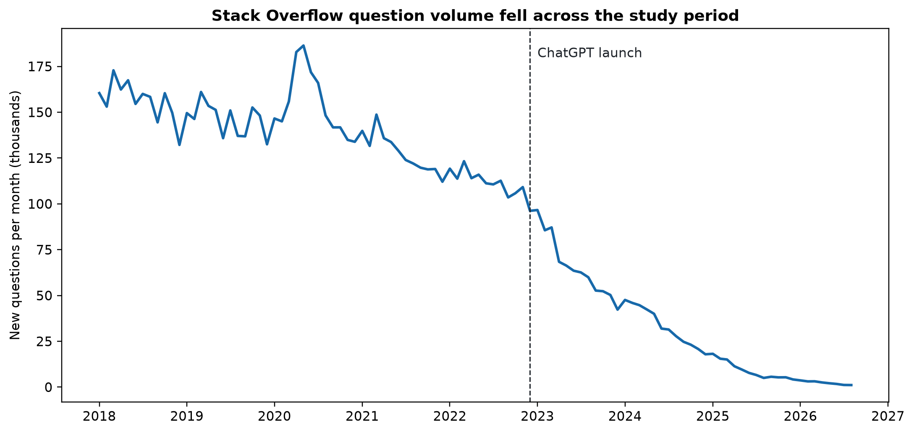
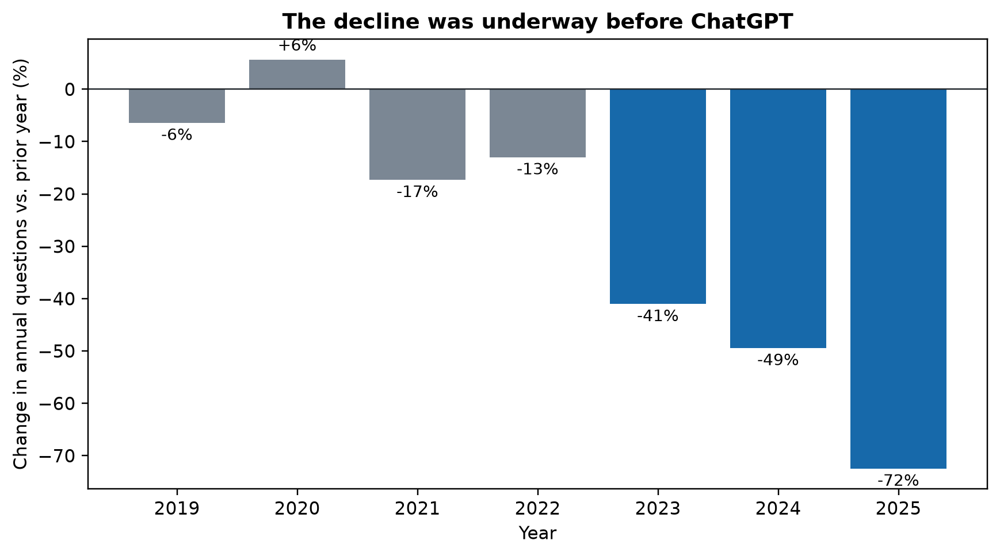
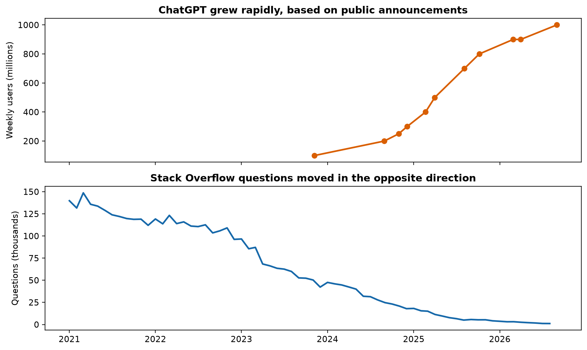
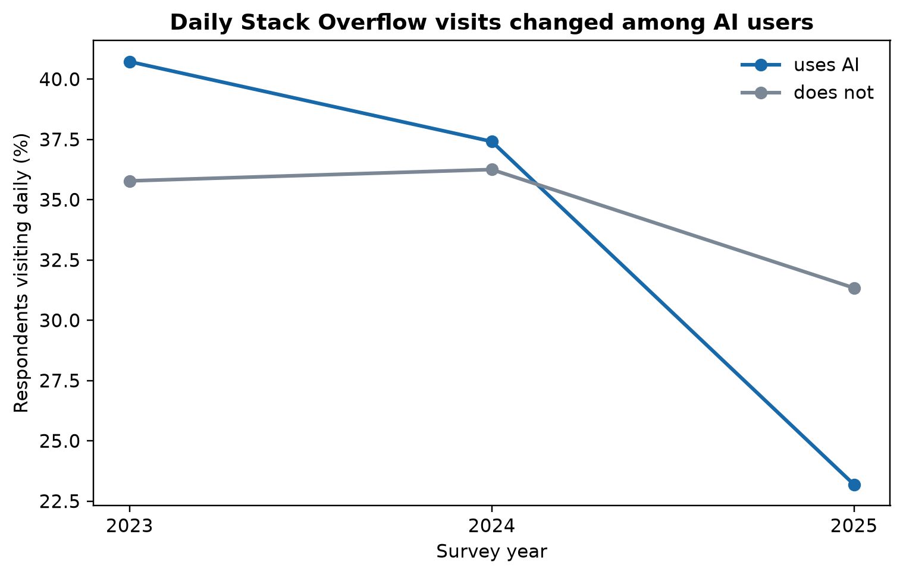
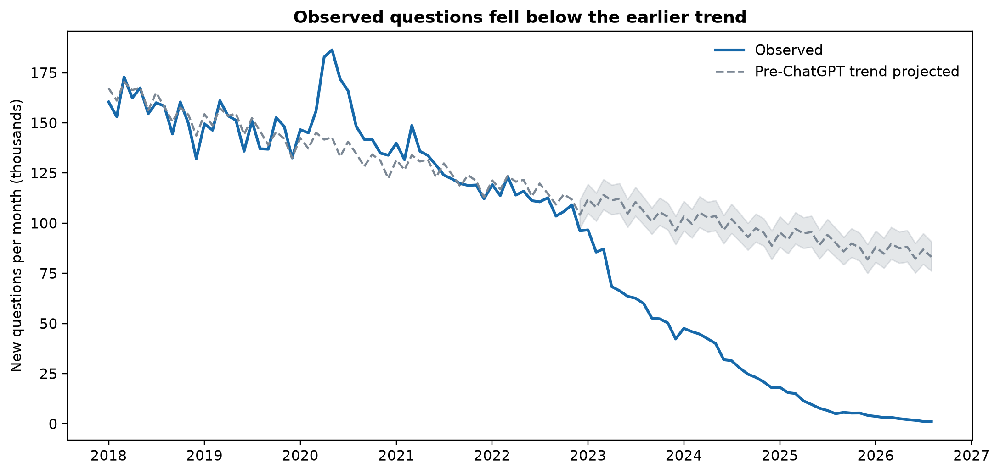
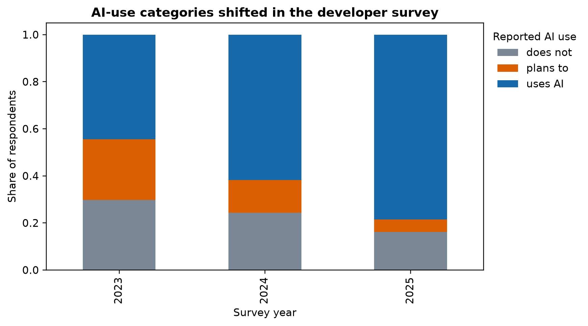

# Project Dossier: The Untold Story of Public Programming Help

## 1. Executive Summary

This project asks what happened to public programming help-seeking as generative AI became common. We compare 104 monthly Stack Overflow question counts from January 2018 through August 2026 with 11 publicly announced ChatGPT weekly-user milestones and three Stack Overflow Developer Survey snapshots from 2023–2025.

The clearest result is a two-part story. Stack Overflow activity was already declining before ChatGPT: the pre-December-2022 model estimates an annual decline of 7.71% after adjusting for month-of-year and the March–June 2020 disruption. After 2022, annual question volume fell 41.00% in 2023, 49.42% in 2024, and 72.45% in 2025. ChatGPT adoption expanded over the same broad period, but these observational data cannot identify ChatGPT as the cause.

The survey adds a behavioral signal. Among respondents who reported AI use and answered the visit-frequency question, the share reporting daily or almost-daily Stack Overflow visits fell from 40.73% in 2023 to 23.19% in 2025. The important takeaway is not that public programming help disappeared, but that one visible channel changed while other channels, including AI tools, became more prominent. The largest limitation is that these sources have different units, sampling mechanisms, and time resolutions.

## 2. The One-Sentence Story

**Central story:** Public Stack Overflow activity fell dramatically during the rise of generative AI, but the decline began before ChatGPT and the available data show association, not causation.

## 3. Target Audience

The audience is students, programmers, educators, and participants in online knowledge communities. They are affected because platform counts are often used informally to judge where technical learning happens. The project teaches them to read activity metrics as partial signals rather than complete measures of learning, quality, or developer ability.

## 4. Dataset Overview

| Source | Unit | Coverage | Size |
|---|---|---|---:|
| Stack Exchange API 2.3 `/questions` | Month | 2018-01 to 2026-08 | 104 months |
| OpenAI/news public announcements | Announcement | 2023-11 to 2026-08 | 11 milestones |
| Stack Overflow Developer Survey | Respondent | 2023, 2024, 2025 | 203,812 cleaned rows |

The Stack Overflow query uses `site=stackoverflow`, `sort=creation`, `filter=total`, and one date-bounded request per calendar month. The API returns a count rather than individual posts. The ChatGPT file preserves each source URL and qualifier such as “about” or “more than”; it is not a continuous measurement. The survey cleaning keeps `AISelect` and `SOVisitFreq`, harmonizes changed answer wording, and retains unanswered responses as missing.

The snapshot was prepared on 2026-09-20. The survey source files are downloaded from the [Stack Exchange Survey repository](https://github.com/StackExchange/Survey), but are ignored because each is larger than GitHub's file-size limit. The cleaned projection is committed so the analysis can be rerun without those large files.

## 5. Data Pipeline

```text
Stack Exchange API + public source files
        ↓
raw CSV snapshots
        ↓
clean.py / preprocess.py
        ↓
cleaned CSVs with harmonized dates and survey labels
        ↓
feature_engineering.py
        ↓
analysis tables and derived indicators
        ↓
analyze.py
        ↓
key_metrics.csv
        ↓
visualize.py
        ↓
publication figures and communication story
```

`download.py` retrieves the API count series and survey files and writes the hand-compiled ChatGPT source table. `clean.py` parses dates, sorts observations, checks the expected 104 monthly observations, harmonizes survey labels, and does not impute missing responses or remove legitimate outliers. `feature_engineering.py` creates the variables listed below. `analyze.py` calculates every number used in this dossier. `visualize.py` reads the feature tables and regenerates the six final figures.

## 6. Cleaning Decisions

| Issue | Action | Records affected | Reason |
|---|---|---:|---|
| Monthly date stored as text | Parse and sort `month` | 104 | Enable time comparisons and plotting |
| ChatGPT announcement date stored as text | Parse `date`; derive announcement month | 11 | Align milestones with monthly series when needed |
| Survey answer wording changed by year | Map equivalent AI-use and visit labels to common categories | 203,812 rows evaluated | Make year comparisons interpretable |
| Survey unanswered responses | Keep as missing | 21,212 AI-use missing; 24,426 visit-frequency missing | Avoid inventing responses |
| Survey raw files absent locally | Retain committed cleaned projection; print a message | 3 source files | Large raw files are ignored and regenerated by `download.py` |
| Extreme Stack Overflow counts | Retain | 0 removed | Counts are the observed public series, not errors |

There are no duplicate rows in the committed monthly and ChatGPT inputs. The monthly cleaner asserts 104 observations and nonmissing counts. No observations are dropped as outliers.

## 7. Engineered Features

| Feature | Formula or derivation | Purpose |
|---|---|---|
| `year` | Year from `month` | Annual summaries |
| `month_name` | Calendar month label | Seasonal context |
| `year_over_year_change_pct` | `(count_t / count_(t-12) - 1) * 100` | Compare same-month annual change |
| `post_chatgpt` | `month >= 2022-12-01` | Mark the period after the November 2022 launch |
| `log_questions` | `log(questions)` | Model relative rather than absolute change |
| `rolling_12_month_median` | Trailing 12-month median | Smooth monthly noise |
| `uses_ai_binary` | `uses_ai == "uses AI"` | Survey group comparison |
| `daily_stackoverflow_visitor` | `visits_so_daily == True` | Compare daily/almost-daily visits |

The log count, calendar controls, and post-launch marker influenced the trend analysis. The survey indicators influenced the daily-visit comparison. No engineered feature is interpreted as a causal treatment.

## 8. Key Findings

### Finding 1: The long decline is real in the snapshot

**Evidence:** 160,440 questions in January 2018 versus 1,130 in August 2026, a change of -99.30%.

**Supporting visualization:** `outputs/figures/01_stackoverflow_questions.png`.

**Interpretation:** The volume of new questions recorded by this API-based monthly series became much smaller over the study period.

**Importance:** Platform activity is not stable enough to be used as a timeless proxy for programming activity.

**Caveat:** The endpoints are not a causal before/after experiment, and the final month is a partial historical snapshot relative to the full multi-year context.

### Finding 2: ChatGPT did not begin the decline

**Evidence:** The largest year-over-year decline through 2022 was -17.29%. A pre-December-2022 log trend, controlling for calendar month and March–June 2020, estimates -7.71% per year.

**Supporting visualization:** `outputs/figures/02_year_over_year_change.png` and `outputs/figures/05_pre_chatgpt_trend_projection.png`.

**Interpretation:** The data support a change in the slope or intensity of an existing decline, not a claim that the decline began at launch.

**Importance:** This guards against a neat but unsupported single-cause story.

**Caveat:** Trend projection depends on model specification and cannot account for every change in the platform or programming ecosystem.

### Finding 3: The decline accelerated after 2022

**Evidence:** Annual question totals changed -41.00% in 2023, -49.42% in 2024, and -72.45% in 2025 compared with the prior year.

**Supporting visualization:** `outputs/figures/02_year_over_year_change.png`.

**Interpretation:** The post-2022 period is materially steeper than the earlier decline in this series.

**Importance:** Timing makes generative AI a plausible part of the context, alongside many alternatives.

**Caveat:** Temporal alignment is not proof of causation; platform policy, search behavior, competition, and programming demand may also matter.

### Finding 4: AI users reported less daily Stack Overflow visiting by 2025

**Evidence:** Daily or almost-daily visiting among AI users was 40.73% in 2023 (n=38,678), 37.41% in 2024 (n=35,663), and 23.19% in 2025 (n=24,922). Among non-users it was 35.78% (n=26,014), 36.25% (n=14,573), and 31.34% (n=5,287).

**Supporting visualization:** `outputs/figures/04_daily_visits_by_ai_use.png`.

**Interpretation:** The survey snapshots show a changing association between reported AI use and reported Stack Overflow visit frequency.

**Importance:** The platform's visible decline is consistent with a broader change in how some developers seek help, but the survey cannot identify individual migration or causality.

**Caveat:** The survey is cross-sectional, self-reported, and has substantial missingness. The groups and respondents do not necessarily represent the same population across years.

## 9. What Surprised Us?

A reasonable first expectation was that ChatGPT would mark the beginning of Stack Overflow's decline. The data show that the monthly series was already moving down before November 2022, with a modeled pre-launch decline of 7.71% per year. The surprise is therefore not simply that the two trends moved in opposite directions; it is that the popular launch-date explanation is incomplete. ChatGPT may be part of the later acceleration, but this evidence cannot separate it from other changes.

## 10. Complete Chart Catalog

### Figure 1 — Stack Overflow question volume fell across the study period

**File:** `outputs/figures/01_stackoverflow_questions.png`

**Purpose:** Show the complete monthly series and the November 2022 launch marker.

**What to notice:** The series declines across the full period, not only after launch.

**Exact numbers:** 160,440 in January 2018; 1,130 in August 2026; -99.30% between endpoints.

**Interpretation and limitation:** This is a descriptive count series, not a causal estimate.

**Use:** Presentation and infographic.



### Figure 2 — The decline was underway before ChatGPT

**File:** `outputs/figures/02_year_over_year_change.png`

**Purpose:** Compare annual changes and distinguish pre- and post-2022 periods.

**What to notice:** Declines existed before 2022, then became larger after it.

**Exact numbers:** Largest pre-2023 decline -17.29%; 2023 -41.00%; 2024 -49.42%; 2025 -72.45%.

**Interpretation and limitation:** This supports a nuanced timing claim, not causality.

**Use:** Presentation and infographic.



### Figure 3 — ChatGPT and Stack Overflow trends

**File:** `outputs/figures/03_chatgpt_and_stackoverflow_trends.png`

**Purpose:** Place the irregular ChatGPT milestones beside the monthly question series.

**What to notice:** ChatGPT milestones rise while Stack Overflow questions fall.

**Exact numbers:** The ChatGPT source table records 100 million in November 2023 and 1,000 million in August 2026, using source qualifiers.

**Interpretation and limitation:** This is contextual juxtaposition. The series have different sources, units, and sampling.

**Use:** Presentation only; use Figure 2 for the infographic if space is limited.



### Figure 4 — Daily Stack Overflow visits changed among AI users

**File:** `outputs/figures/04_daily_visits_by_ai_use.png`

**Purpose:** Compare survey-reported daily/almost-daily visits by AI-use category.

**What to notice:** AI users move from a higher daily-visit share in 2023 to a lower share than non-users in 2025.

**Exact numbers:** AI users: 40.73% to 23.19%; non-users: 35.78% to 31.34%.

**Interpretation and limitation:** Cross-sectional survey association; not evidence that AI use caused a person to stop visiting.

**Use:** Presentation and infographic.



### Figure 5 — Observed questions fell below the earlier trend

**File:** `outputs/figures/05_pre_chatgpt_trend_projection.png`

**Purpose:** Show a cautious counterfactual based on the pre-launch model.

**What to notice:** Observed post-launch counts sit below the projected earlier trend.

**Exact numbers:** Pre-launch modeled annual change -7.71%.

**Interpretation and limitation:** A model-based comparison is useful context but sensitive to specification and omitted changes.

**Use:** Presentation or appendix.



### Figure 6 — AI-use categories shifted in the survey

**File:** `outputs/figures/06_survey_ai_use_categories.png`

**Purpose:** Show the changing composition of AI-use responses.

**What to notice:** The share of respondents in the “uses AI” category rises while the categories and missingness also change across survey years.

**Exact numbers:** Cleaned rows by year: 89,184 in 2023; 65,437 in 2024; 49,191 in 2025.

**Interpretation and limitation:** Year-to-year sample composition differs, so this is not a longitudinal panel.

**Use:** Appendix only.



## 11. Limitations

- **Observational design:** The data show timing and association, not that ChatGPT caused Stack Overflow's decline.
- **Different measurement systems:** API counts, public-user milestones, and survey responses are not interchangeable measures.
- **Irregular ChatGPT milestones:** OpenAI did not publish a continuous weekly-user series, and the reported values use qualifiers such as “about” and “more than.”
- **Platform scope:** Stack Overflow users and survey respondents are not all programmers, students, or developers worldwide.
- **Time at risk:** Older posts have had longer to accumulate attention, while recent months may be incomplete or behave differently under changing API conditions.
- **Survey composition:** The 2023, 2024, and 2025 samples are cross-sectional and have different sizes and missingness; the same people were not followed.
- **Unmeasured alternatives:** Search engines, documentation, coding assistants, site policy, moderation, labor-market conditions, and programming-language trends may all affect question volume.
- **Survivorship and visibility:** Deleted or poorly indexed content is not represented, and public counts reflect what remains visible to the API.

## 12. Bias

The dataset overrepresents people who use Stack Overflow or choose to answer its survey and underrepresents developers who use private teams, documentation, search, courses, or other assistants. Popularity and age can increase visibility and accumulated activity. Survey nonresponse can be related to AI use or platform habits. These biases mean the results describe visible Stack Overflow and survey behavior, not all programming help-seeking.

## 13. Ethical Implications

This project uses aggregation rather than naming or ranking individuals. Public data still deserves restraint: a visit frequency, score, or question count is not a measure of a person's ability, effort, or value. Readers should not conclude that AI users are less capable, that Stack Overflow is no longer useful to anyone, or that ChatGPT alone caused the observed change. Responsible communication keeps the causal uncertainty visible and avoids turning platform decline into a judgment about the people who use either tool.

## 14. What the Data Can and Cannot Say

### Supported by the evidence

- Stack Overflow monthly question counts declined substantially in this snapshot.
- The decline was already present before November 2022.
- The annual decline was steeper in 2023–2025 than the largest pre-2023 annual decline.
- Reported daily Stack Overflow visits among AI users fell between the 2023 and 2025 survey snapshots.

### Not supported by the evidence

- That ChatGPT caused the decline.
- That every developer moved from Stack Overflow to ChatGPT.
- That question count measures learning, quality, or developer ability.
- That the survey percentages represent all developers.
- That the public ChatGPT milestones form a precise continuous growth curve.

## 15. Presentation Material: Recommended 8-Minute Outline

### Slide 1 — A disappearing question mark? (0:40)

**Core message:** Public Stack Overflow question volume fell dramatically, but the story is more complicated than a single launch date.

**Figure:** Figure 1.

**On-slide points:** 104 monthly observations; January 2018–August 2026; -99.30% endpoint change.

**Speaker notes:** Introduce the audience's familiar experience of searching for programming help. State the question and preview the caution about causality.

**Transition:** “Before attributing the change to ChatGPT, we checked when the decline actually began.”

### Slide 2 — Why this matters (0:50)

**Core message:** Platform activity is often treated as a proxy for where learning happens.

**Figure:** None or a cropped Figure 1.

**On-slide points:** Students and developers use multiple help channels; public counts are partial signals; audience takeaway is better measurement literacy.

**Speaker notes:** Explain why the question affects educators and online communities, not just one website.

**Transition:** “To test the launch-date story, we assembled three different kinds of evidence.”

### Slide 3 — Three imperfect lenses (0:55)

**Core message:** The project combines an API count series, irregular public milestones, and survey responses.

**Figure:** Figure 3.

**On-slide points:** 104 months; 11 ChatGPT milestones; 203,812 cleaned survey rows; different units and limitations.

**Speaker notes:** Explain the unit of observation and why juxtaposition is contextual rather than causal.

**Transition:** “The first result is that Stack Overflow was already declining.”

### Slide 4 — The decline predates ChatGPT (1:05)

**Core message:** The decline did not begin at the November 2022 launch.

**Figure:** Figure 2.

**On-slide points:** Largest pre-2023 decline -17.29%; pre-launch modeled trend -7.71% per year; 2023 -41.00%.

**Speaker notes:** Emphasize the surprising result and distinguish the baseline trend from later acceleration.

**Transition:** “The timing still changed after 2022, so we examined how much the observed path diverged from that earlier trend.”

### Slide 5 — The post-launch gap (1:10)

**Core message:** Counts fell below the earlier modeled trajectory, but the gap has many possible explanations.

**Figure:** Figure 5.

**On-slide points:** Model controls for month and early-pandemic months; actual versus projected; not a causal counterfactual.

**Speaker notes:** Explain the projection plainly and state what it cannot prove.

**Transition:** “We then looked for a behavioral signal in the developer survey.”

### Slide 6 — A behavior signal, not a causal verdict (1:10)

**Core message:** Daily Stack Overflow visiting among AI users fell from 40.73% to 23.19% across survey snapshots.

**Figure:** Figure 4.

**On-slide points:** AI users: 40.73% in 2023 to 23.19% in 2025; non-users: 35.78% to 31.34%; cross-sectional samples.

**Speaker notes:** Give denominators, mention missing responses, and avoid saying that AI use caused a respondent's behavior to change.

**Transition:** “The responsible conclusion is therefore narrower than the dramatic version.”

### Slide 7 — What we can responsibly remember (1:00)

**Core message:** Generative AI belongs in the context, but it is not proven to be the sole cause.

**Figure:** Figure 2 or Figure 4 as a small recap.

**On-slide points:** decline began earlier; decline accelerated later; behavior shifted; aggregate evidence needs ethical interpretation.

**Speaker notes:** Close with the one-sentence story, limitations, and a reminder that public metrics are not measures of human ability.

**Total estimated time:** 6 minutes 50 seconds, leaving approximately 70 seconds for natural pacing or questions while remaining under 8 minutes.

## 16. Infographic Material

**Headline:** Stack Overflow's decline did not start with ChatGPT.

**Subtitle:** Public programming help changed as AI tools expanded, but the timeline tells a more careful story.

**Hero statistic:** `-99.30%` change in monthly questions from January 2018 to August 2026.

**Visual #1:** Use Figure 1 to show the long decline.

**Visual #2:** Use Figure 2 to show that declines predated ChatGPT and accelerated afterward.

**Visual #3:** Use Figure 4 to show the survey behavior signal: AI-user daily visits fell from 40.73% in 2023 to 23.19% in 2025.

**Surprise callout:** The pre-ChatGPT modeled trend was already -7.71% per year.

**Why it matters:** Developers do not rely on one visible public channel for help. Platform counts can change when tools, search habits, and communities change, so they should not be mistaken for a complete measure of learning or technical work.

**Limitations box:** These are observational, platform-specific data. The survey years are different cross-sectional samples, ChatGPT values are irregular announcements, and the analysis cannot prove causation.

**Ethics box:** Use aggregate patterns responsibly. Do not infer ability, quality, or personal behavior from a public metric.

**Final takeaway:** The right story is not “AI replaced Stack Overflow”; it is “public programming help changed, and the change began before the headline event.”

**Source footer:** Stack Exchange API 2.3; Stack Overflow Developer Survey 2023–2025; public ChatGPT milestone sources listed in `data/raw/chatgpt_weekly_users.csv`. Accessed 2026-09-20.

## 17. Brief Written Explanation for the Infographic

Stack Overflow has become a much quieter public question channel: the monthly series fell from 160,440 questions in January 2018 to 1,130 in August 2026. It is tempting to draw a straight line from that decline to ChatGPT's November 2022 launch. The data tell a more useful story. The decline was already underway before ChatGPT, with a modeled pre-launch trend of -7.71% per year. It then became much steeper: annual question counts fell 41.00% in 2023, 49.42% in 2024, and 72.45% in 2025.

A second lens comes from the Stack Overflow Developer Survey. Among respondents who reported AI use and answered the visit question, 40.73% reported visiting Stack Overflow daily or almost daily in 2023, compared with 23.19% in 2025. This is consistent with a changing help-seeking environment, but it is not proof that AI use caused people to stop visiting. The surveys are different cross-sectional samples, and the ChatGPT figures are irregular public milestones rather than a continuous measurement.

The audience for this story is students, developers, educators, and anyone who uses online technical communities. The key lesson is about interpretation: a platform's visible activity is only one measure of a much larger learning ecosystem. Public counts can fall because behavior, tools, search practices, policies, or populations change. They should not be used to judge an individual developer's ability or the quality of every answer. The evidence supports a changing programming-help landscape, not a single-cause replacement story.

## 18. Numbers Safe to Use Publicly

Every value below is generated in `outputs/tables/key_metrics.csv`:

- 104 monthly Stack Overflow observations from January 2018 through August 2026.
- 160,440 questions in January 2018.
- 1,130 questions in August 2026.
- -99.30% change between those endpoints.
- -17.29% largest year-over-year decline through 2022.
- -7.71% modeled annual pre-December-2022 trend.
- -41.00% in 2023, -49.42% in 2024, and -72.45% in 2025.
- AI-user daily visit shares: 40.73% in 2023, 37.41% in 2024, 23.19% in 2025.
- Non-user daily visit shares: 35.78% in 2023, 36.25% in 2024, 31.34% in 2025.
- Survey denominators for AI-user daily visit shares: 38,678, 35,663, and 24,922.
- Survey denominators for non-user daily visit shares: 26,014, 14,573, and 5,287.

## 19. Talking Points

1. The monthly Stack Overflow series is a count of newly created questions, not a count of all programming activity.
2. The API query uses one date-bounded request per month and returns the API's total.
3. The data cover January 2018 through August 2026.
4. The survey rows are respondents, not unique developers followed over time.
5. Missing survey answers were retained and excluded only from the relevant comparison.
6. Features include year-over-year change, log counts, calendar controls, and binary survey indicators.
7. The decline predates ChatGPT, while the post-2022 decline is steeper.
8. The public ChatGPT milestones are irregular and qualified announcements.
9. No result is presented as causal.
10. The workflow is reproducible through scripts, a metrics CSV, and figure generation.

## 20. Questions We May Be Asked

**Why choose this dataset?** It connects a visible public programming-help channel with a major change in how developers can seek answers, while keeping the scope measurable and reproducible.

**How representative is it?** It represents activity visible through Stack Overflow and respondents to the Stack Overflow survey, not all developers or all help-seeking.

**Why create the log trend feature?** Relative changes are easier to compare across a series whose absolute monthly counts vary greatly; the model also controls for calendar month and early-pandemic months.

**Why use these charts?** The line chart shows the full timeline, the bars make acceleration legible, and the group line chart exposes the survey association without implying individual trajectories.

**Is the relationship causal?** No. The data are observational, the sources differ, and important confounders are unmeasured.

**What is the biggest limitation?** The three sources do not measure the same population or unit, so their temporal alignment is informative context rather than an experiment.

**What surprised you?** The decline was already present before ChatGPT; the launch-date explanation is incomplete.

**What would you analyze next?** Question-level tags, views, answers, accepted answers, and search/referral data could distinguish topic shifts and engagement changes if collected with a documented sampling design.

## 21. Final Quality-Control Record

- **Analysis:** Scripts run end to end in the workspace `.venv`; metrics and figures were regenerated.
- **Repository:** README, requirements, `.env.example`, data policy, scripts, figures, and dossier are present.
- **Storytelling:** Audience, question, surprise, findings, caveats, bias, and ethics are explicit.
- **Raw/clean data:** Monthly and ChatGPT raw/clean files are committed; survey raw files are documented as regenerable and the cleaned projection is committed.
- **Security:** The API-key-looking value was replaced in `.env.example`; the real `.env` remains ignored. Because the old value exists in the initial commit, the associated key should be rotated if it was ever valid.
- **GitHub collaboration:** **Action required.** Current history has one commit, one branch, and one contributor. Do not fabricate this requirement; each group member must make a meaningful branch and pull request and participate in review.
